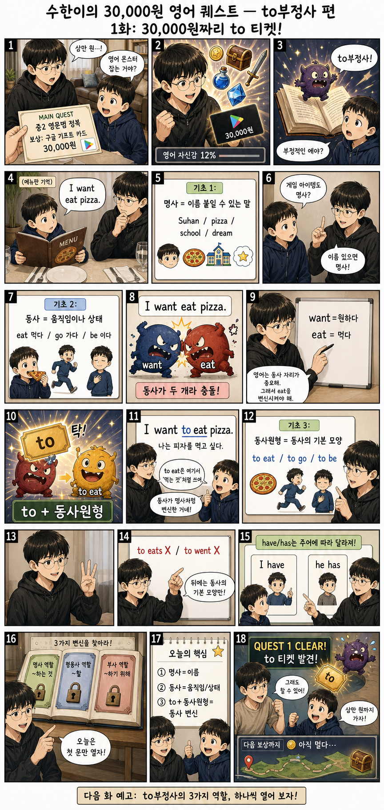

# Comics

학습용 만화 콘텐츠를 모아 두는 저장소입니다.

## 수한이와 수인이의 중2 수학 2학기 대모험

실사풍 일본 만화 스타일의 중2 2학기 전체 수학 개념 만화 완결본입니다.

[전체 보기](middle-school-math/grade8-semester2-concept-manga/)

## 중2 수학 2-2 · 도형의 닮음 학습만화

GitHub에서 바로 볼 수 있도록 Markdown에 이미지로 정리했습니다.

### 1화: 도형의 닮음 완전정복

### 2화: 삼각형 닮음 조건 3총사

### 3화: 평행선과 선분의 길이의 비

### 4화: 닮음의 활용

### 추가 보존본: 첫 생성 시안

## 수한이의 30,000원 영어 퀘스트 — to부정사 편

실사에 가까운 일본 만화풍의 중2 영문법 to부정사 학습만화입니다.

[전체 보기](middle-school-english/to-infinitive-quest/)

## 폴더

- [중학교 수학 학습만화](middle-school-math/)
- [중학교 영어 학습만화](middle-school-english/)
- [도형의 닮음 단원](middle-school-math/geometry-similarity/)
