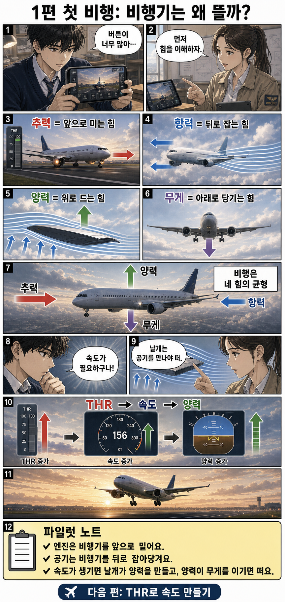
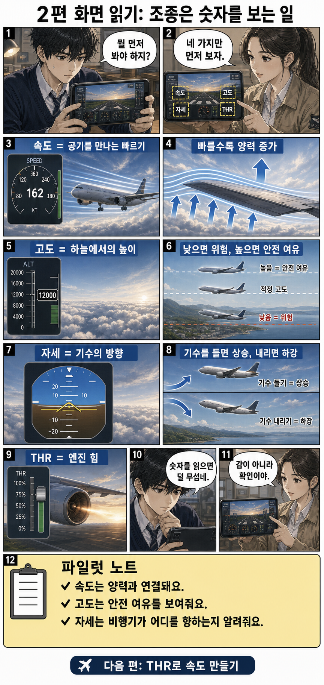
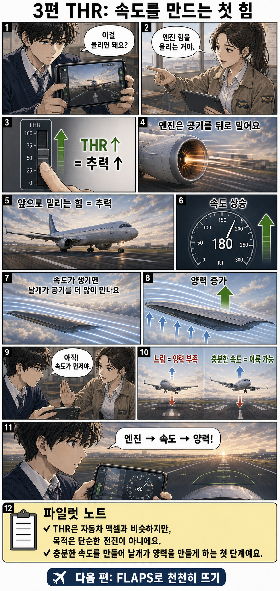
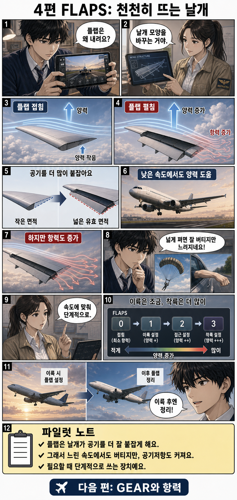
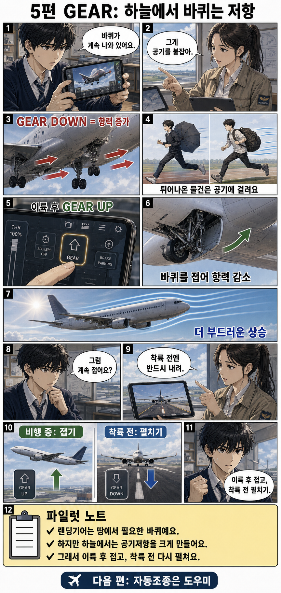
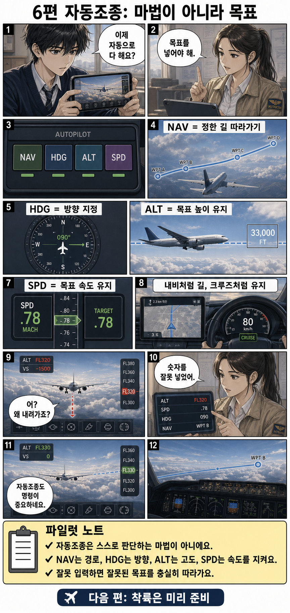
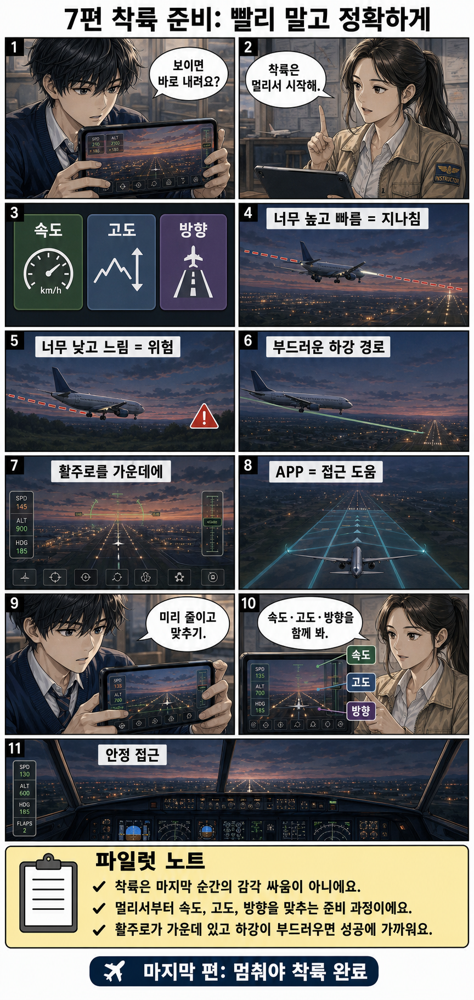
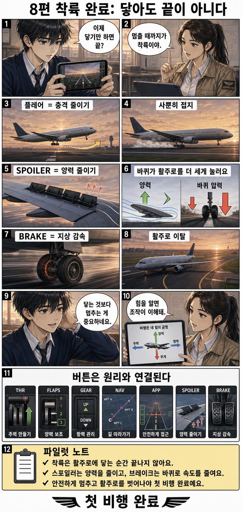

# RFS 초보 파일럿 교실 — 첫 비행 편

모바일 비행 시뮬레이터 사용법을 **게임 조작 + 비행 원리 학습**으로 함께 설명하는 한국어 교육 만화입니다.

> 주의: 공식 RFS 화면이나 로고를 복제하지 않고, 설명용 **가상 비행 시뮬레이터 UI**로 제작했습니다.

## 전체 보기

아래에서 1편부터 8편까지 전체 내용을 순서대로 볼 수 있습니다.

### 1편. 비행기는 왜 뜰까: 추력·항력·양력·무게

---

### 2편. 화면 읽기: 속도·고도·자세·THR

---

### 3편. THR: 속도를 만드는 첫 힘

---

### 4편. FLAPS: 천천히 뜨는 날개

---

### 5편. GEAR: 하늘에서 바퀴는 저항

---

### 6편. 자동조종: 마법이 아니라 목표

---

### 7편. 착륙 준비: 빨리 말고 정확하게

---

### 8편. 착륙 완료: 닿아도 끝이 아니다

---

## 파일 목록

| 편 | 주제 | 파일 |
|---:|---|---|
| 1 | 비행기는 왜 뜰까: 추력·항력·양력·무게 | [`pages/01-why-airplanes-fly.png`](pages/01-why-airplanes-fly.png) |
| 2 | 화면 읽기: 속도·고도·자세·THR | [`pages/02-reading-the-screen.png`](pages/02-reading-the-screen.png) |
| 3 | THR: 속도를 만드는 첫 힘 | [`pages/03-throttle-and-speed.png`](pages/03-throttle-and-speed.png) |
| 4 | FLAPS: 천천히 뜨는 날개 | [`pages/04-flaps-and-lift.png`](pages/04-flaps-and-lift.png) |
| 5 | GEAR: 하늘에서 바퀴는 저항 | [`pages/05-gear-and-drag.png`](pages/05-gear-and-drag.png) |
| 6 | 자동조종: 마법이 아니라 목표 | [`pages/06-autopilot-goals.png`](pages/06-autopilot-goals.png) |
| 7 | 착륙 준비: 빨리 말고 정확하게 | [`pages/07-landing-preparation.png`](pages/07-landing-preparation.png) |
| 8 | 착륙 완료: 닿아도 끝이 아니다 | [`pages/08-landing-complete.png`](pages/08-landing-complete.png) |

## 제작 방향

- 실사풍에 가까운 세밀한 일본 만화풍 일러스트
- 중고등학생 미소년 주인공과 전문 교관 캐릭터
- 버튼 암기가 아니라 비행 원리 이해 중심
- 초보자가 게임을 하면서 추력, 항력, 양력, 무게, 플랩, 기어, 자동조종, 착륙 절차를 배워가도록 구성
