# 수한이의 30,000원 영어 퀘스트 — to부정사 편

실사에 가까운 일본 만화풍으로 만든 중2 영문법 **to부정사** 학습만화입니다. 영어 기초가 약한 독자도 따라올 수 있도록 명사, 동사, 주어, 목적어, 보어, have/has 같은 기초 개념을 중간중간 설명합니다.

## 콘셉트

수한이(중2 형)가 영어 문법 퀘스트를 모두 깨면 **구글 기프트 카드 30,000원**을 받을 수 있습니다. 초3 동생 수인이는 기초 질문과 코믹한 오답을 담당하고, 수한이는 설명하면서 스스로 영어 자신감을 회복합니다.

## 본편 12화

### 1화: 30,000원짜리 to 티켓!

### 2화: 영어 문장의 기본 뼈대

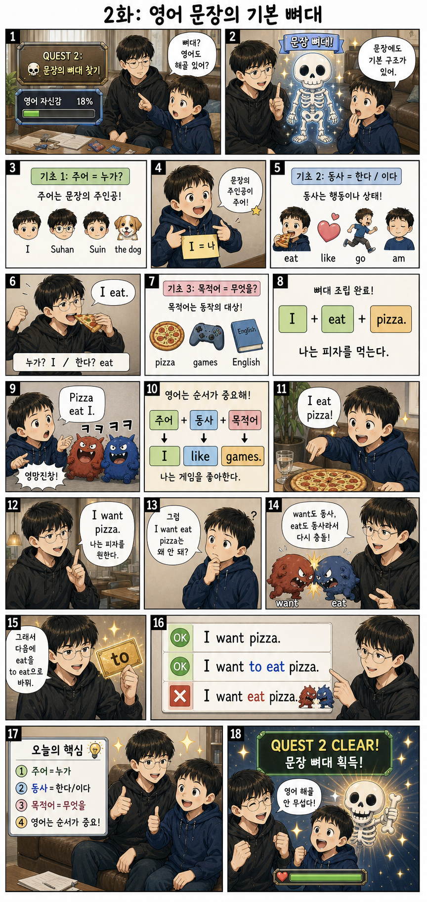

### 3화: have와 has의 비밀

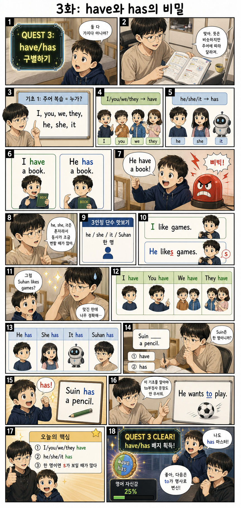

### 4화: 명사처럼 변신! ~하는 것

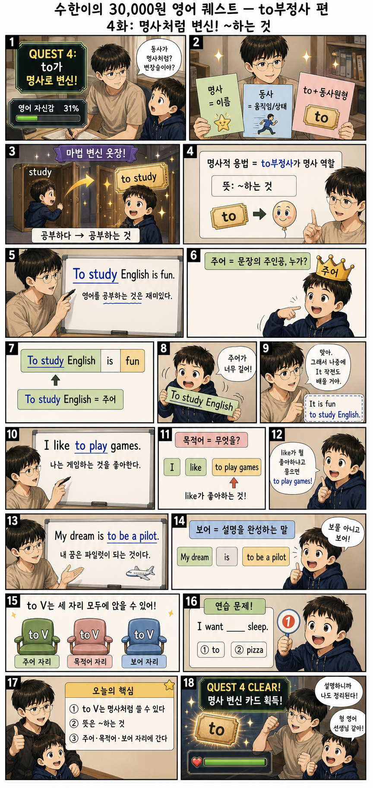

### 5화: 목적어 자리에 앉는 to

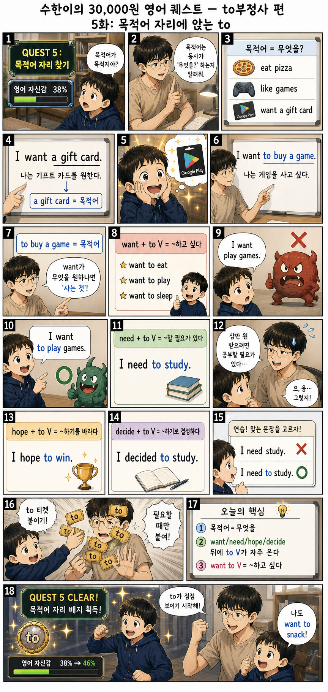

### 6화: 보어가 뭐야?

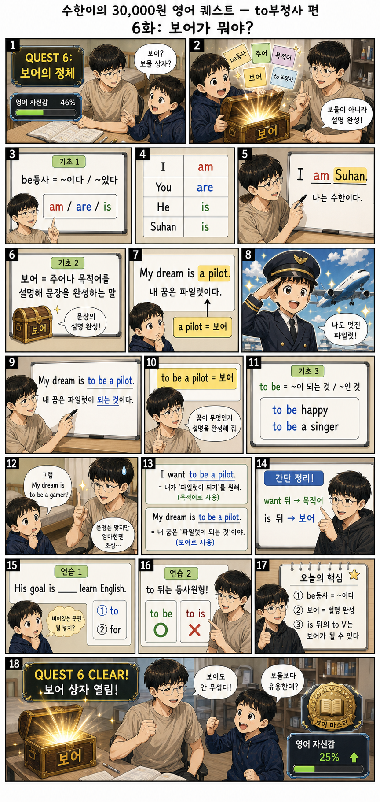

### 7화: It 가짜 주어 작전

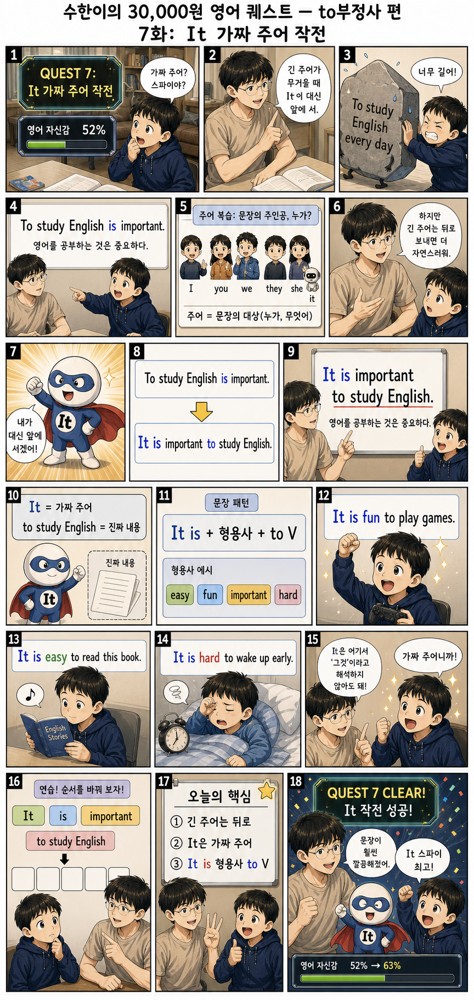

### 8화: 무엇을 할지 모르겠어!

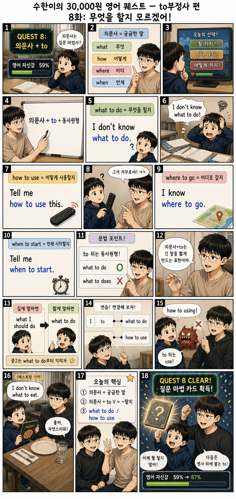

### 9화: 명사 뒤에 붙는 to

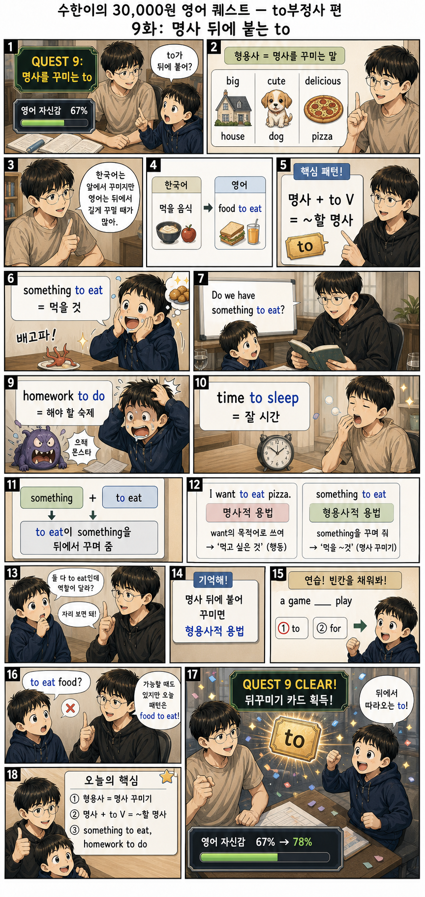

### 10화: 왜 했는지 말해줘!

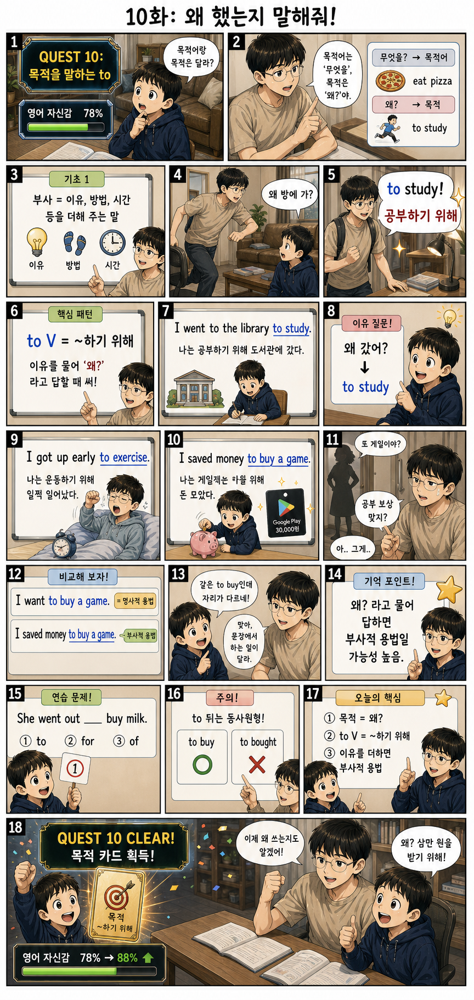

### 11화: too와 enough 보스전

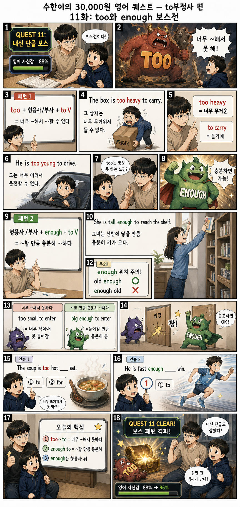

### 12화: to부정사 최종 보스전

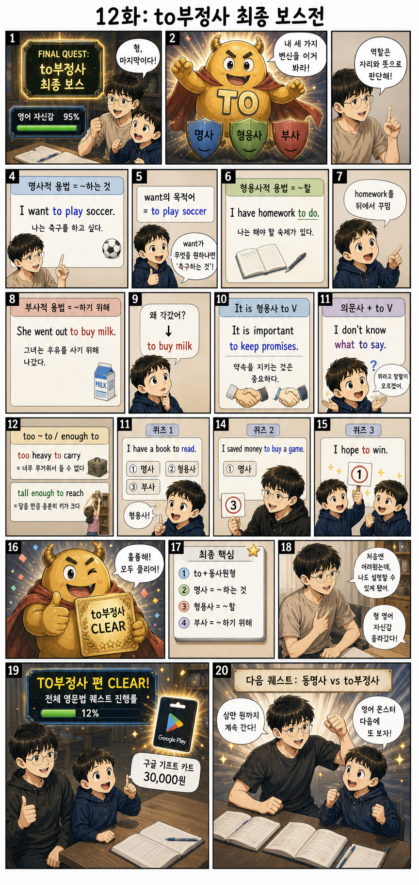

## 제작 문서

- [시리즈 바이블](series-bible.md)
- [1~4화 스토리보드](storyboard-episodes-01-04.md)
- [5~8화 스토리보드](storyboard-episodes-05-08.md)
- [9~12화 스토리보드](storyboard-episodes-09-12.md)
- [이미지 생성 프롬프트 기록](image-prompts.md)
