# 수한이와 수인이의 중2 과학 2학기 현장 탐험

오투 중학 과학 2-2 목차 흐름을 참고해 만든 **중학교 2학년 2학기 과학 개념 만화**입니다.

수한이가 주인공으로 개념을 정리하고, 수인이가 아파트 풋살장·공원·과학관·옥상 같은 현장에서 질문하며 직접 깨닫는 구성입니다.

> 참고: 특정 교재의 지면, 로고, 디자인을 복제하지 않고 단원 흐름만 학습용으로 재구성했습니다.

## 전체 보기

### 1화. 햇빛을 먹는 식물? — 광합성

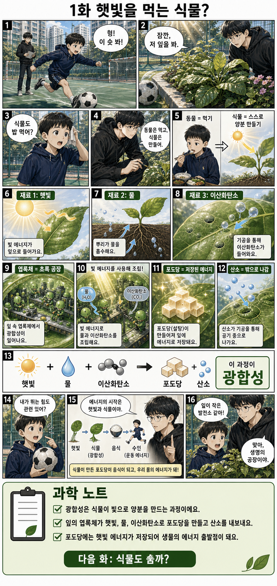

---

### 2화. 식물도 숨을 쉴까? — 식물의 호흡

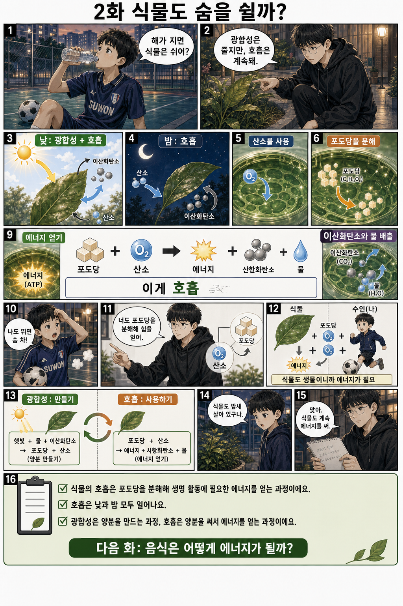

---

### 3화. 음식은 어떻게 힘이 될까? — 소화와 영양소

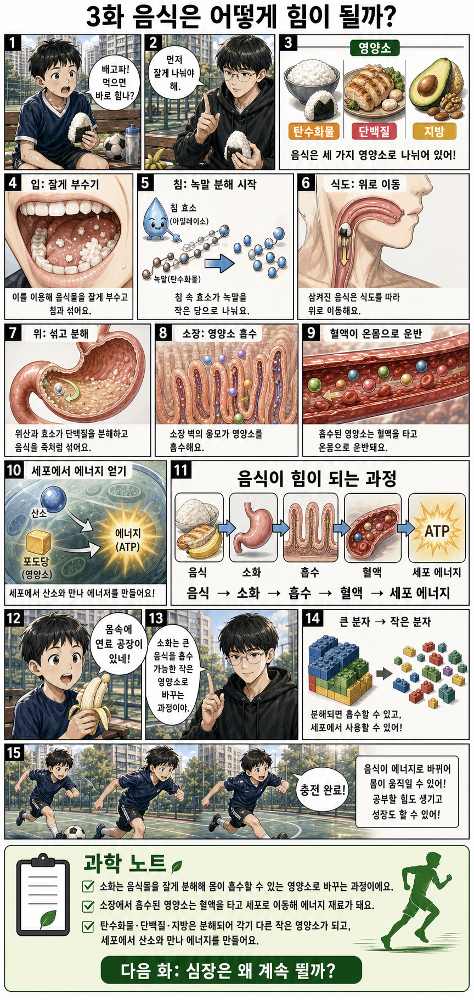

---

### 4화. 심장은 왜 계속 뛸까? — 순환

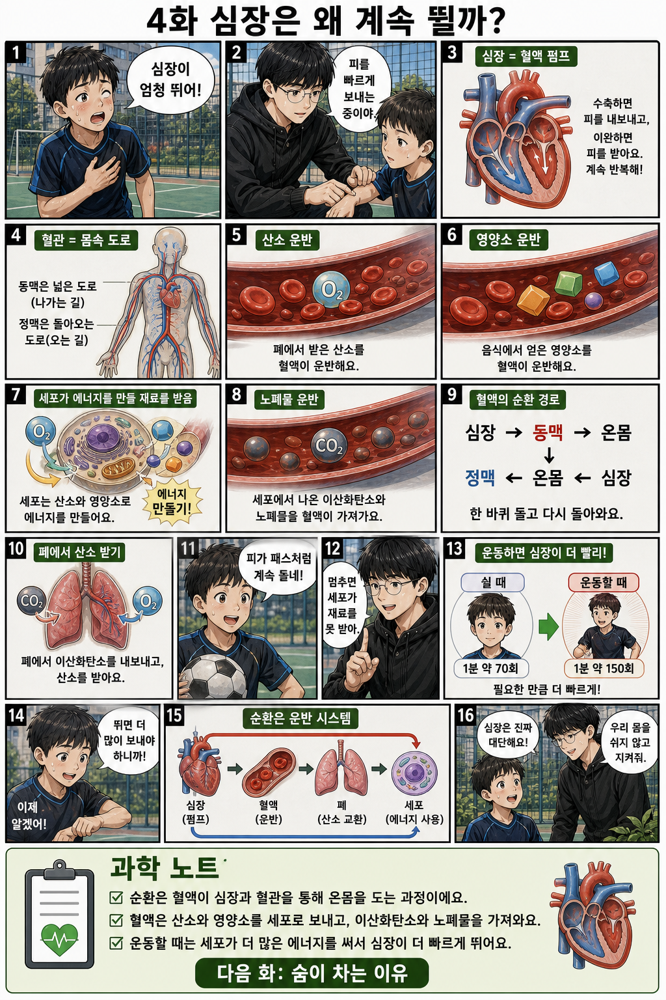

---

### 5화. 숨이 차는 이유 — 호흡과 기체 교환

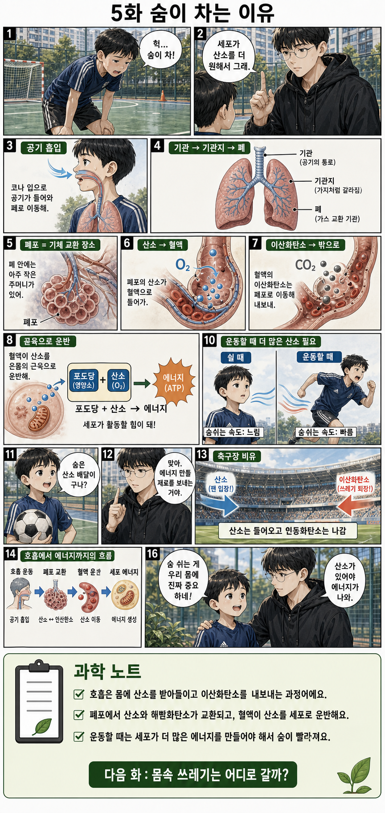

---

### 6화. 몸속 쓰레기는 어디로 갈까? — 배설

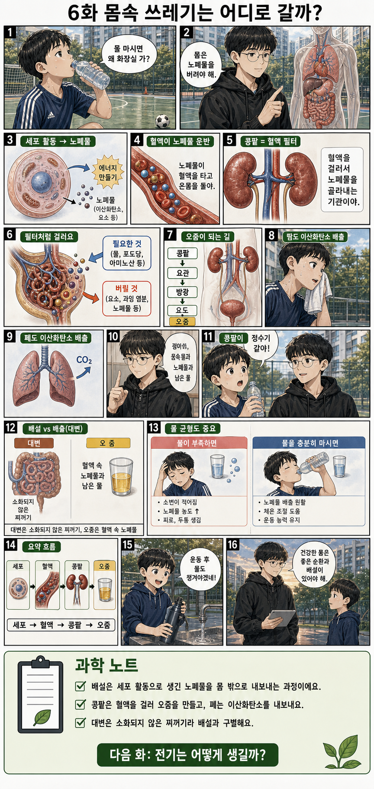

---

### 7화. 전기는 어떻게 생길까? — 전기의 발생

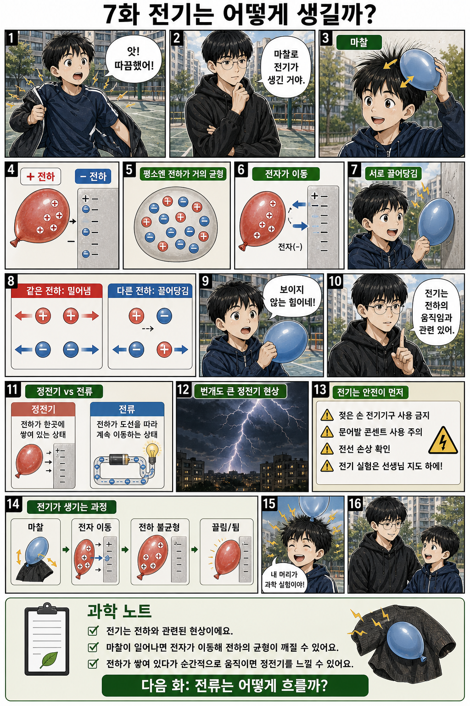

---

### 8화. 전류는 어떻게 흐를까? — 전기 회로와 에너지

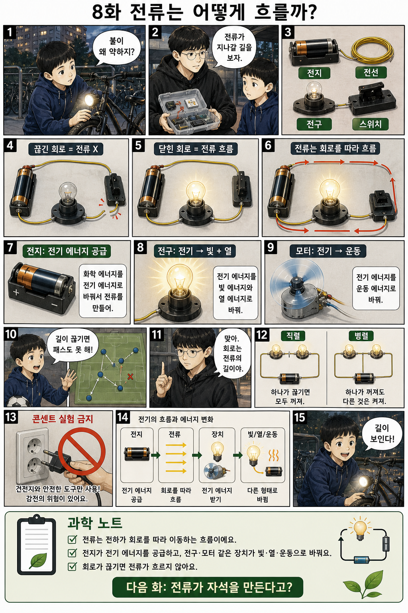

---

### 9화. 전류가 자석을 만든다고? — 전류의 자기 작용

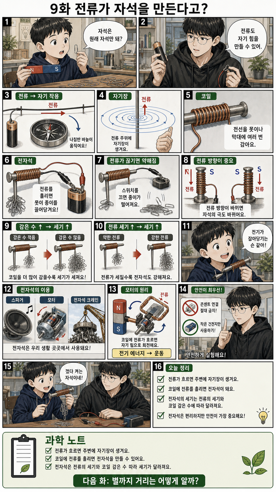

---

### 10화. 별까지 거리는 어떻게 알까? — 별까지의 거리

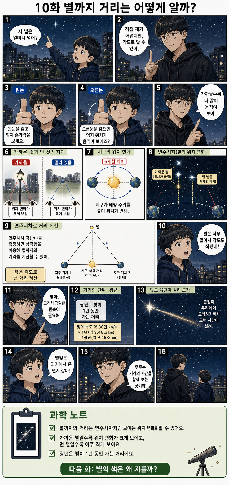

---

### 11화. 별의 색은 왜 다를까? — 별의 특성

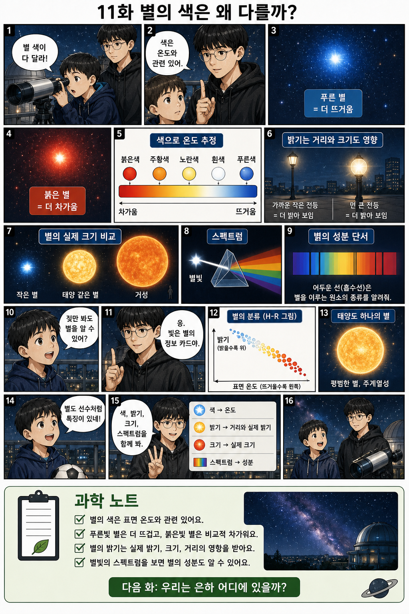

---

### 12화. 우리는 은하 어디에 있을까? — 우리은하

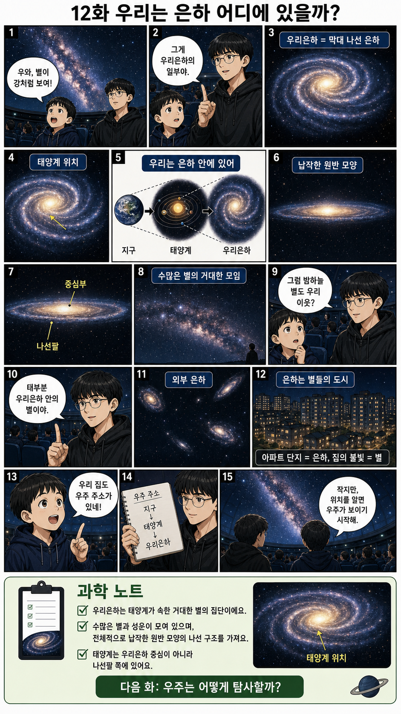

---

### 13화. 우주는 어떻게 탐사할까? — 우주 탐사

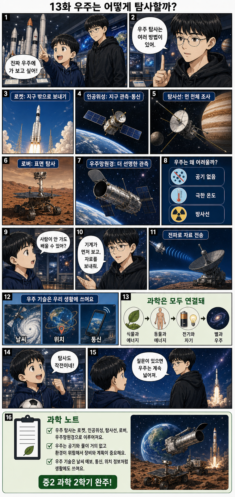

---

## 파일 목록

| 화 | 주제 | 파일 |
|---:|---|---|
| 1 | 광합성 | [`pages/01-photosynthesis.png`](pages/01-photosynthesis.png) |
| 2 | 식물의 호흡 | [`pages/02-plant-respiration.png`](pages/02-plant-respiration.png) |
| 3 | 소화와 영양소 | [`pages/03-digestion-and-nutrients.png`](pages/03-digestion-and-nutrients.png) |
| 4 | 순환 | [`pages/04-circulation.png`](pages/04-circulation.png) |
| 5 | 호흡과 기체 교환 | [`pages/05-breathing-and-gas-exchange.png`](pages/05-breathing-and-gas-exchange.png) |
| 6 | 배설 | [`pages/06-excretion.png`](pages/06-excretion.png) |
| 7 | 전기의 발생 | [`pages/07-electricity-generation.png`](pages/07-electricity-generation.png) |
| 8 | 전기 회로와 에너지 | [`pages/08-circuits-and-energy.png`](pages/08-circuits-and-energy.png) |
| 9 | 전류의 자기 작용 | [`pages/09-current-and-magnetism.png`](pages/09-current-and-magnetism.png) |
| 10 | 별까지의 거리 | [`pages/10-distance-to-stars.png`](pages/10-distance-to-stars.png) |
| 11 | 별의 특성 | [`pages/11-star-properties.png`](pages/11-star-properties.png) |
| 12 | 우리은하 | [`pages/12-milky-way.png`](pages/12-milky-way.png) |
| 13 | 우주 탐사 | [`pages/13-space-exploration.png`](pages/13-space-exploration.png) |

## 제작 방향

- 수한·수인 캐릭터 레퍼런스 준수
- 집에서 책만 보는 구성이 아니라 현장에서 발견하고 이해하는 전개
- 개념 암기가 아니라 “왜 그런지”를 쉽게 이해하는 설명 중심
- 광합성, 호흡, 소화, 순환, 배설, 전기, 자기, 별과 우주를 생활 장면과 연결
